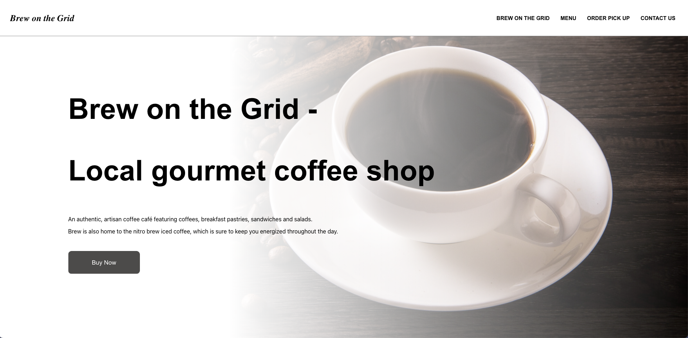
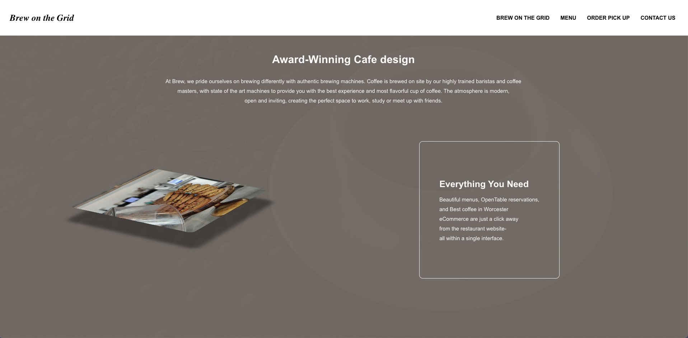

# MIS585 Assginment6
> MIS585 homework in Module 10 --- Assignment 6
# Introduction
> The project is a Front-end project without Back-end with React
  In this project, there is no other component library. These interactions
  all comes from CSS.
# Using
```
git clone https://github.com/ScheWann/MIS585_Assginment6.git

cd Intramural-Forum-Website

npm install

npm start

```
# ScreenShot
<h3>Login</h3>

<h3>Forum</h3>
